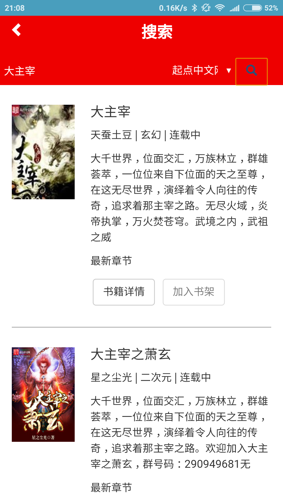
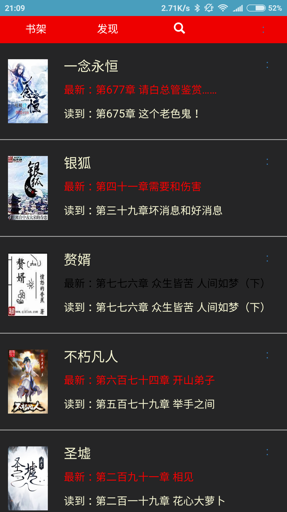

# ChDCNovelReader

## 简介

用于追小说的 App。

## 功能

* 从各大书源搜索小说
* 自动从各大书源获取最新章节
* 夜间模式

## 当前支持的书源

* [起点中文网](http://www.qidian.com/)
* [创世中文网](http://chuangshi.qq.com/)
* [大主宰小说网](http://www.daizhuzai.com/)
* [笔趣楼](http://www.biqulou.net/)
* [笔趣阁 TW](http://www.biquge.com.tw/)
* [笔趣阁中文网](http://www.biqugezw.com/)
* [笔趣阁](http://www.biquge.com/)

## 声明

本 App 不得用于商业用途。否则，后果自负。

## 技术框架

本项目基于 Corodva 框架实现。

## 截图

## 使用技巧

* 拖动书架中书籍右边的两个点可以对书籍进行排序
* 当当前章节的质量不好时，点击“劣质章节”可以从其他书源加载该章节

## TODO

* 缓存封面
* 百度搜索
* 搜索记录
* 卷
* 首次启动强制更新资源
* 更新后提示资源更新内容

* 弹出框响应 Android 的返回键

